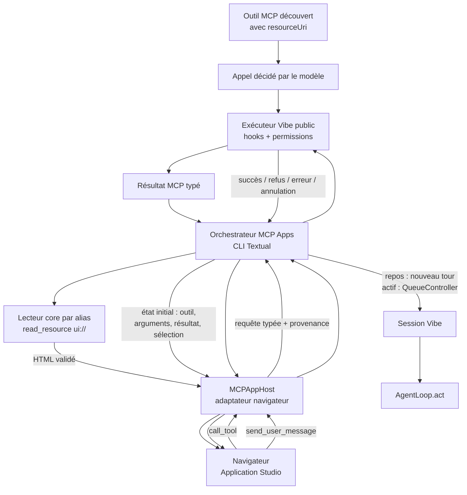

# Cartographie de l’intégration MCP Apps dans Vibe

Cette cartographie décrit le code observé sur cette branche. Les mentions **Vérifié**
désignent un comportement présent dans le dépôt ; les mentions **Proposé** décrivent
le glue minimal à construire après réception des trois branches parallèles. Aucun nom
d’API proposé ci-dessous n’est supposé déjà accepté par ces branches.

Les frontières retenues suivent `docs/adr/0001-architecture-principles.md`,
`docs/adr/0002-core-engine-and-delivery-surfaces.md`,
`docs/adr/0003-event-driven-agent-loop.md`,
`docs/adr/0004-typed-permissioned-tools.md` et
`docs/adr/0007-extension-mechanisms.md` : le core porte les contrats neutres, les
événements et les permissions ; la CLI Textual orchestre l’expérience locale ; un
adaptateur dédié porte le navigateur et son protocole.

## 1. Résumé de l’architecture actuelle

Vibe construit un `AgentLoop` autour d’un `ToolManager`, d’un `MCPRegistry` et d’un
`MCPConnectionPool`. La découverte MCP fabrique des classes dynamiques de
`MCPTool`, ensuite exposées au modèle comme les autres outils. Quand le modèle
demande un outil, l’agent loop parse et valide ses arguments, exécute les hooks,
évalue la permission, crée l’`InvokeContext`, appelle l’outil, puis publie des
événements typés consommés par Textual. Les messages utilisateur passent par
`AgentLoop.act`; pendant un tour actif, la CLI les sérialise avec
`QueueController`.

Il n’existe actuellement ni conservation de `_meta.ui.resourceUri`, ni lecture de
ressource `ui://`, ni `MCPAppHost`, ni API publique permettant à une interface
d’exécuter arbitrairement un outil en réutilisant tout le pipeline de permission.
La recherche de `read_resource`, `ui://` et `MCPAppHost` dans `vibe/` est vide ;
`vibe/core/tools/mcp/pool.py::MCPConnectionPool` n’expose que `call_tool` et
`aclose`. Ces quatre absences sont des faits vérifiés, et non des suppositions de
conception.

### A. Découverte des outils MCP

#### Création et enregistrement des serveurs

**Vérifié.** La configuration active est une liste de `MCPServer` portée par
`VibeConfig.mcp_servers` dans `vibe/core/config/_settings.py`. Les variantes
`MCPStdio`, `MCPHttp` et `MCPStreamableHttp`, avec leur base `_MCPBase`, sont
définies dans `vibe/core/config/models.py`; `_MCPBase.name` est l’alias Vibe du
serveur.

`AgentLoop.__init__` dans `vibe/core/agent_loop/_loop.py` crée ou reçoit un
`MCPRegistry`, crée un `MCPConnectionPool`, puis fournit le registre au
`ToolManager`. `AgentLoop._complete_init` appelle
`ToolManager.integrate_all`, lequel atteint `ToolManager._integrate_mcp_async`
dans `vibe/core/tools/manager.py`. Cette méthode demande les classes d’outils à
`MCPRegistry.get_tools_async`, puis les fusionne dans `ToolManager._all_tools`.

Le client SDK n’est pas conservé par le registre. Les `ClientSession` sont créées
au moment de la découverte dans `list_tools_http` ou `list_tools_stdio`, et au
moment de l’exécution dans les helpers d’appel ou dans le worker persistant du
pool (`vibe/core/tools/mcp/tools.py`, `vibe/core/tools/mcp/pool.py`).

#### Appel de `list_tools` et conversion SDK → Vibe

**Vérifié.** Le chemin complet est :

1. `MCPRegistry._discover_all` lance la découverte des serveurs configurés ;
2. `MCPRegistry._discover_http` ou `_discover_stdio` appelle respectivement
   `list_tools_http` ou `list_tools_stdio` ;
3. ces fonctions initialisent un `mcp.ClientSession`, appellent
   `ClientSession.list_tools()`, puis valident chaque objet SDK avec
   `RemoteTool.model_validate` ;
4. le registre appelle `create_mcp_http_proxy_tool_class` ou
   `create_mcp_stdio_proxy_tool_class` ;
5. la factory retourne une sous-classe dynamique de `MCPTool`, enregistrée dans
   `ToolManager._all_tools` sous le nom public `{alias}_{nom_distant}`.

Les symboles de découverte sont dans `vibe/core/tools/mcp/registry.py`; les
fonctions SDK et factories sont dans `vibe/core/tools/mcp/tools.py`; `RemoteTool`
et `MCPTool` sont dans `vibe/core/tools/remote.py`.

#### Conservation des attributs d’un outil distant

| Information | Source observée | Conservation au runtime |
| --- | --- | --- |
| Alias/identité du serveur | `_MCPBase.name` | `MCPRegistry._servers_by_alias`, puis `MCPTool._server_name` et `MCPTool.get_server_name()` |
| Nom distant | `RemoteTool.name` | `MCPTool._remote_name` et `MCPTool.get_remote_name()` |
| Nom publié | Factory de proxy | `MCPTool.name`, sous la forme `{alias}_{nom_distant}` |
| Description | `RemoteTool.description` | attribut de classe `description`, puis `ToolManager.available_tool_specs` |
| Schéma d’arguments | `RemoteTool.input_schema`, alias Pydantic `inputSchema` | `MCPTool._input_schema`, exposé par `parameters` |
| Permission | défaut `BaseToolConfig.permission = ASK` | configuration d’outil résolue par `ToolManager.get_tool_config`, puis éventuel override `PermissionStore` |

**Vérifié.** `RemoteTool` ne déclare aujourd’hui que `name`, `description` et
`input_schema`. La validation Pydantic ignore donc la future métadonnée SDK
`_meta.ui.resourceUri`. Aucun autre modèle actuel ne peut la restituer.

**Proposé.** Le futur `resourceUri` doit être porté à deux niveaux :

- sur le modèle de découverte `RemoteTool`, qui est la frontière de validation de
  la donnée externe ;
- sur la classe dynamique `MCPTool`, idéalement via un descripteur public immuable
  contenant au moins alias serveur, nom publié, nom distant et URI.

Le stocker uniquement dans `MCPToolResult` serait insuffisant : la CLI doit savoir
qu’un outil est une MCP App avant ou au moment de corréler son appel et son
résultat. À l’inverse, conserver uniquement la métadonnée SDK brute obligerait les
surfaces à connaître le format du SDK, en conflit avec les ADR.

### B. Exécution des outils

#### Chemin modèle → appel MCP

**Vérifié.** Le chemin exact est le suivant :

1. le backend retourne une `LLMMessage` contenant des `tool_calls` ;
2. `APIToolFormatHandler.parse_message` dans `vibe/core/llm/format.py` décode le
   JSON en `ParsedToolCall` (`raw_args`, `tool_name`, `call_id`) ;
3. `APIToolFormatHandler.resolve_tool_calls` recherche la classe dans
   `ToolManager.available_tools`, valide le modèle Pydantic d’arguments et produit
   un `ResolvedToolCall` (`validated_args`, `args_dict`, `tool_class`, `call_id`) ;
4. `AgentLoop._handle_tool_calls` émet le `ToolCallEvent` complet, puis
   `_run_tools_concurrently` crée une tâche par appel ;
5. `AgentLoop._process_one_tool_call` appelle `_execute_tool_call` ;
6. `_execute_tool_call` résout l’instance, exécute les hooks pré-outil, applique
   les éventuelles réécritures ou interdictions, puis appelle
   `_should_execute_tool` ;
7. si l’appel est autorisé, `_invoke_tool` construit l’`InvokeContext` et appelle
   `BaseTool.invoke` ;
8. `BaseTool.invoke` revalide les arguments et appelle `MCPTool.run` ;
9. le proxy stdio utilise `InvokeContext.mcp_pool.call_tool` quand le pool est
   présent, sinon `call_tool_stdio`; le proxy HTTP utilise `call_tool_http` ;
10. le worker du `MCPConnectionPool` ou le helper one-shot appelle finalement
    `ClientSession.call_tool(nom_distant, arguments)`.

Les étapes 4 à 7 sont dans `vibe/core/agent_loop/_loop.py`; la création de
l’`InvokeContext` est dans `AgentLoop._invoke_tool`; les étapes 8 à 10 sont dans
`vibe/core/tools/base.py`, `vibe/core/tools/remote.py`,
`vibe/core/tools/mcp/tools.py` et `vibe/core/tools/mcp/pool.py`.

#### Arguments, résultat brut et événements

Les arguments sont accessibles successivement dans
`ParsedToolCall.raw_args`, `ResolvedToolCall.validated_args`/
`ResolvedToolCall.args_dict`, `ToolCallEvent.args`, puis dans le modèle d’arguments
reçu par `MCPTool.run`. Le futur host doit recevoir les arguments validés du
`ToolCallEvent` complet, pas ceux d’un éventuel événement partiel de streaming.

Le résultat SDK brut est transformé par `_parse_call_result` dans
`vibe/core/tools/mcp/tools.py`. Le modèle interne `_MCPResultIn` privilégie
`structuredContent`; sinon il concatène les blocs texte. Il produit
`MCPToolResult(ok, server, tool, text, structured)`. Cette conversion perd
actuellement les blocs non textuels et toute métadonnée non déclarée. De plus,
`MCPToolResult.server` vaut l’URL HTTP ou `stdio:<commande>`, et non forcément
l’alias configuré.

Les événements d’outil typés de `vibe/core/types.py` observés autour de l’appel
sont :

- avant : `ToolCallEvent`; en streaming, une première occurrence peut avoir
  `args=None`, puis l’occurrence complète du même `tool_call_id` porte les
  arguments validés ;
- pendant : `ToolStreamEvent`, ainsi que `HookRunStartEvent`, `HookStartEvent`,
  `HookEndEvent` et `HookRunEndEvent` de `vibe/core/hooks/models.py` lorsque des
  hooks s’exécutent ;
- après : `ToolResultEvent`, avec `result`, `error`, `skipped`, `skip_reason`,
  `cancelled`, `duration` et le même identifiant d’appel.

`VibeApp._handle_agent_loop_events` dans
`vibe/cli/textual_ui/app.py` transmet ces événements à
`EventHandler.handle_event` dans `vibe/cli/textual_ui/event_handler.py`.
`EventHandler` corrèle les widgets d’appel et de résultat par identifiant.

#### Point de remise au host

**Proposé.** Pour un appel décidé par le modèle, l’orchestrateur CLI doit observer
la paire `ToolCallEvent` complet/`ToolResultEvent` dans le flux déjà consommé par
`VibeApp._handle_agent_loop_events`. À cet endroit, il dispose de :

- `ToolCallEvent.tool_name` et `ToolCallEvent.args` ;
- `ToolResultEvent.result`, ou son erreur/refus/annulation ;
- `event.tool_class`, vérifiable comme sous-classe de `MCPTool`, donnant
  `get_server_name()` et `get_remote_name()` ;
- le futur descripteur public porté par cette classe, donc `resourceUri`.

La corrélation doit se faire avec `tool_call_id`, jamais seulement avec le nom de
l’outil, car `_run_tools_concurrently` autorise plusieurs appels simultanés. Pour
un appel initié par l’App, le même ensemble d’informations doit revenir de la
future API publique d’exécution sous forme d’événements typés ou d’un résultat
typé équivalent.

### C. Permissions

**Vérifié.** `ToolPermission` (`ALWAYS`, `ASK`, `NEVER`) et
`BaseToolConfig` sont définis dans `vibe/core/tools/base.py`. La décision canonique
est `AgentLoop._should_execute_tool` dans `vibe/core/agent_loop/_loop.py` :

1. elle traite le bypass global éventuel ;
2. elle prend le verrou de `PermissionStore` ;
3. elle demande d’abord à `tool.resolve_permission(args)` une permission
   granulaire ;
4. à défaut, elle utilise `ToolManager.get_tool_config(tool_name).permission` ;
5. `ALWAYS` autorise, `NEVER` refuse ;
6. `ASK` consulte les règles approuvées de `PermissionStore`, puis
   `approval_callback`; l’absence de callback refuse l’appel.

`PermissionContext`, `RequiredPermission`, les règles et le verrou sont dans
`vibe/core/tools/permissions.py`. Côté Textual,
`VibeApp._approval_callback` utilise `_user_interaction_lock` et l’écran
d’approbation pour obtenir une `ApprovalResponse`.

**Vérifié.** Aucune API publique actuelle ne permet de soumettre un appel d’outil
arbitraire à ce pipeline. `BaseTool.invoke` ne décide pas de la permission ; les
helpers `call_tool_stdio`, `call_tool_http`, `MCPConnectionPool.call_tool` et le
client SDK non plus. Appeler l’un d’eux depuis le navigateur ou le host
contournerait aussi les hooks, la télémétrie, les événements, l’annulation et la
finalisation de l’agent loop.

**Proposé.** Le core doit exposer une API publique et neutre de surface, par
exemple conceptuellement `AgentLoop.execute_tool_request(...) ->
AsyncGenerator[Event, None]`. Son nom final reste au propriétaire du core, mais
son contrat doit obligatoirement :

- rechercher et valider l’outil avec `ToolManager` ;
- exécuter les mêmes hooks et `AgentLoop._should_execute_tool` ;
- construire un `InvokeContext` complet avec callbacks, managers, répertoire de
  session, sampling, plan, skill, scratchpad, `PermissionStore`, hooks,
  `session_id` et `mcp_pool` ;
- réutiliser les événements de résultat, refus, erreur et annulation ;
- accepter une provenance d’appel « MCP App » sans exposer de méthode privée.

Le host traduit alors `ToolResultEvent` en réponse sérialisable : succès avec le
résultat, refus avec `skipped=true` et `skip_reason`, erreur avec `error`, et
annulation avec `cancelled=true`. Il ne doit jamais appeler directement le client
MCP.

Un point doit être décidé explicitement dans cette future API :
`AgentLoop._handle_tool_response` ajoute actuellement un message `role=tool` à
l’historique du tour modèle. Un appel hors bande de l’App ne doit pas créer un
message outil orphelin. Pour le MVP, le résultat est retourné au host et audité par
événements, sans insertion dans l’historique, sauf si le core introduit un couple
de messages neutre et cohérent pour ce cas.

### D. Agent loop et conversation

**Vérifié.** Le chemin normal d’un nouveau message est :

`VibeApp.on_chat_input_container_submitted`
→ `VibeApp._dispatch_idle_input`
→ `VibeApp._handle_user_message`
→ tâche `_handle_agent_loop_turn`
→ `AgentLoop.act`
→ `AgentLoop._conversation_loop`
→ `AgentLoop._open_user_turn`.

`_open_user_turn`, dans `vibe/core/agent_loop/_loop.py`, ajoute le
`LLMMessage(role=user)` à `MessageList`, sauvegarde la session et émet
`UserMessageEvent`.

Pendant un tour actif, `VibeApp._handle_queue_submit` appelle
`VibeApp._enqueue_prompt_with_resources`, puis
`QueueController.enqueue_prompt` dans
`vibe/cli/textual_ui/message_queue.py`. `MessageQueue` est une structure typée de
prompts, pas une `asyncio.Queue`. Son drain ne démarre que si l’application n’est
ni active, ni occupée, ni en pause. Dans le `finally` de
`VibeApp._handle_agent_loop_turn`, la tâche active est libérée puis
`QueueController.start_drain_if_needed` est appelée.

Lors du drain, tous les prompts groupés sauf le dernier peuvent être ajoutés par
`AgentLoop.inject_user_context(as_message=True)`; le dernier démarre le nouveau
tour avec `AgentLoop.act`. Pour un unique message venant d’une MCP App, le
comportement naturel est donc un nouveau tour après le tour actif.

**Proposé.** `send_user_message` doit passer par une entrée publique de
l’orchestrateur de queue Textual :

- si Vibe est au repos, elle démarre le chemin normal `AgentLoop.act` ;
- si un outil ou un tour est actif, elle ajoute un élément à la queue et attend la
  fin du tour entier, pas seulement la fin de l’appel d’outil courant ;
- elle n’annule rien implicitement ; si l’utilisateur demande explicitement une
  interruption, le message reste en queue jusqu’à la fin de l’annulation ;
- elle ne modifie jamais `MessageList`, `_pending_injected_messages` ou une autre
  donnée privée.

`AgentLoop.inject_user_context` est public mais ajoute directement à l’historique;
il n’est pas une primitive de synchronisation et ne doit pas être appelé
concurremment par le host. `_pending_injected_messages` est privé et sert à injecter
du contexte dans le tour courant ; ce n’est pas le contrat de
`send_user_message`.

Pour associer candidature et paragraphe sélectionnés, la queue future doit porter
`UserDisplayContentMetadata` de `vibe/core/types.py`, déjà accepté par
`AgentLoop.act` et persisté avec `LLMMessage`. Des champs de contenu peuvent
identifier l’App, la candidature et le paragraphe. Comme
`vibe/core/llm/backend/generic.py` retire cette métadonnée du payload envoyé au
modèle, le texte utile de la sélection doit également être rendu explicitement
dans le contenu utilisateur. La métadonnée sert à la provenance et à l’affichage,
pas au raisonnement du modèle.

Le risque principal est deux appels concurrents à `AgentLoop.act`, qui
muteraient la même `MessageList` et entrelaceraient les événements. Le MVP doit
donc sérialiser les messages App par la queue existante. Pour les appels d’outils
initiés par l’App, le MVP le plus sûr est aussi de les mettre derrière le tour
agent actif. Le `MCPConnectionPool` sérialise déjà les requêtes stdio d’une même
connexion, mais ce verrou de transport ne protège ni l’historique, ni les hooks,
ni l’interface.

### E. Textual et cycle de vie

**Vérifié.** L’`AgentLoop` interactif est assemblé par `_run_interactive` dans
`vibe/cli/cli.py`. `run_textual_ui` dans
`vibe/cli/textual_ui/app.py` crée la `VibeApp`, puis exécute
`_run_app_with_cleanup`. `VibeApp.on_mount` installe l’`EventHandler`, les
callbacks d’approbation et d’entrée utilisateur, ainsi que les workers.

`_run_app_with_cleanup` appelle toujours `VibeApp.shutdown_cleanup` dans son
`finally`, y compris après erreur ou `SIGTERM`. `shutdown_cleanup` passe par
`_begin_shutdown`, interdit les nouvelles opérations, annule et attend les tâches
d’agent et de shell, ferme les managers, puis appelle `AgentLoop.aclose`.
`AgentLoop.aclose` ferme notamment le `MCPConnectionPool`.

Les autres frontières de session sont :

- `VibeApp._resume_local_session`, qui remplace le `session_id` et recharge
  l’historique ;
- `AgentLoop._reset_session`, utilisé notamment par clear/compaction ;
- les événements de contexte qui indiquent un changement d’identité de session.

**Proposé.** La CLI Textual doit orchestrer le host via un adaptateur dédié, et
conserver une référence à un orchestrateur de fonctionnalité, pas au client MCP
ni à l’implémentation du navigateur directement. Le core fournit des descripteurs,
la lecture typée `ui://` et l’exécution permissionnée ; l’adaptateur dédié gère le
serveur loopback, le protocole navigateur et la sérialisation. Cette répartition
respecte les ADR 0001/0002 et évite de faire grossir `app.py` avec l’état local de
la fonctionnalité.

Le démarrage est paresseux, après un `ToolResultEvent` réussi corrélé à un outil
possédant `resourceUri`. La lecture de ressource, la validation HTML et
l’ouverture du host doivent être exécutées dans une tâche asynchrone ou un worker
Textual ; aucun subprocessus, accès fichier, serveur ou appel à
`webbrowser.open` ne doit bloquer la boucle UI.

Le cycle de vie proposé est :

| Transition | Comportement du host |
| --- | --- |
| Résultat réussi d’une nouvelle MCP App | Lire et valider la nouvelle ressource ; fermer/remplacer atomiquement l’ancienne App après succès |
| Nouvelle App invalide | Signaler l’erreur ; conserver l’ancienne App stable si elle existe |
| Reprise, clear ou changement de session | Fermer avant de changer l’identité de session ; annuler lecture/ouverture en cours |
| Interruption d’un tour | Annuler la requête App en cours et lui retourner `cancelled`; conserver un host déjà stable dans la même session |
| Refus ou erreur d’un appel d’outil App | Retourner l’état structuré ; ne pas fermer automatiquement le host |
| Erreur fatale du transport host | Fermer l’instance et invalider sa référence |
| Fermeture de Vibe ou `SIGTERM` | Fermer le host de façon idempotente avant `AgentLoop.aclose` |

Le dépôt utilise déjà `webbrowser.open` dans
`vibe/cli/textual_ui/widgets/mcp_oauth_app.py::MCPOAuthApp._open_browser` et dans
l’écran d’authentification des connecteurs. Le futur adaptateur doit réutiliser le
module standard multiplateforme, mais appeler
`await asyncio.to_thread(webbrowser.open, url)` afin de ne pas bloquer Textual.
Le host doit retourner une URL loopback prête à ouvrir ; le navigateur ne reçoit
jamais de coordonnées ni de client MCP.

Attention au nom : `vibe/cli/textual_ui/widgets/mcp_app.py::MCPApp` est
actuellement l’écran Textual de statut/configuration MCP. Ce symbole n’est pas le
futur `MCPAppHost` navigateur.

## 2. Diagramme du flux actuel

```mermaid
flowchart LR
    Model[Modèle / backend LLM]
    Format[APIToolFormatHandler<br/>parse + validation]
    Loop[AgentLoop<br/>_handle_tool_calls]
    Hooks[Hooks pré-outil]
    Perm[AgentLoop._should_execute_tool<br/>ALWAYS / ASK / NEVER]
    Tool[MCPTool.invoke / run]
    Pool[MCPConnectionPool<br/>ou helper HTTP]
    Client[mcp.ClientSession.call_tool]
    Parse[_parse_call_result<br/>MCPToolResult]
    Events[ToolCallEvent<br/>ToolStreamEvent<br/>ToolResultEvent]
    UI[VibeApp → EventHandler<br/>interface Textual]

    Model --> Format --> Loop --> Hooks --> Perm
    Perm -->|autorisé| Tool --> Pool --> Client --> Parse --> Events --> UI
    Perm -->|refusé| Events
    Loop -->|appel typé| Events
```

Le flux d’événements n’est pas strictement placé après le résultat :
`ToolCallEvent` est émis avant l’exécution, les flux arrivent pendant, puis
`ToolResultEvent` termine l’appel. Le diagramme compacte ces trois temps.

## 3. Diagramme du flux MCP Apps proposé

Le lecteur `ui://` sélectionne le serveur par alias conservé sur le descripteur de
l’outil. Pour stdio, il doit utiliser la connexion possédée par
`MCPConnectionPool` afin de rester sur la même session MCP. Il ne doit pas exposer
le `ClientSession` à la CLI ou au navigateur.

## 4. Tableau des points d’intégration

| Fichier | Symbole | Rôle actuel | Modification future | Propriétaire pressenti | Risque de conflit |
| --- | --- | --- | --- | --- | --- |
| `vibe/core/tools/remote.py` | `RemoteTool` | Valide nom, description et schéma SDK | Préserver la métadonnée Apps | Branche MCP core/métadonnées | Élevé : fichier central annoncé comme modifié en parallèle |
| `vibe/core/tools/remote.py` | `MCPTool` | Porte alias, nom distant, schéma et exécute le proxy | Exposer un descripteur public avec `resourceUri` | Branche MCP core/métadonnées | Élevé : factory et runtime doivent partager le même contrat |
| `vibe/core/tools/mcp/tools.py` | `list_tools_*`, factories | Découvre et fabrique les proxies | Propager le descripteur sans ad hoc SDK dans la CLI | Branche MCP core/métadonnées | Élevé : deux transports et parsing de résultat |
| `vibe/core/tools/mcp/tools.py` | `_parse_call_result` | Convertit le résultat SDK en `MCPToolResult` | Préserver seulement les champs de résultat nécessaires, avec sérialisation sûre | Branche MCP core/métadonnées | Moyen : ne pas confondre métadonnée d’outil et métadonnée de résultat |
| `vibe/core/tools/mcp/pool.py` | `MCPConnectionPool`, `_StdioConnection` | Sérialise les appels stdio persistants | Ajouter une lecture de ressource par opération typée sur le worker | Branche MCP core/métadonnées | Élevé : toucher au protocole interne de queue et à la fermeture |
| `vibe/core/tools/mcp/registry.py` | `MCPRegistry._servers_by_alias` | Indexe les configurations par alias | Fournir/résoudre la configuration nécessaire au lecteur public | Branche MCP core/métadonnées | Moyen : ne pas exposer le dictionnaire privé |
| `vibe/core/agent_loop/_loop.py` | `_execute_tool_call`, `_should_execute_tool`, `_invoke_tool` | Pipeline canonique hooks/permission/contexte/exécution | Extraire ou envelopper une API publique d’appel App | Futur glue/core agent | Élevé : méthodes privées et historique `role=tool` |
| `vibe/core/types.py` | événements d’outil | Contrat entre core et surfaces | Réutiliser les événements ; n’ajouter une provenance que si nécessaire | Futur glue/core agent | Moyen : contrat public consommé par ACP et CLI |
| `vibe/cli/textual_ui/event_handler.py` | `EventHandler.handle_event` | Rend les événements d’outils | Rester focalisé rendu ; ne pas lui donner le cycle de vie du host | Futur glue CLI | Faible si l’observation reste en amont |
| `vibe/cli/textual_ui/app.py` | `_handle_agent_loop_events` | Distribue le flux à Textual | Déléguer les événements pertinents à l’orchestrateur Apps | Futur glue CLI | Moyen : chemin chaud et concurrence des tâches |
| `vibe/cli/textual_ui/message_queue.py` | `QueueController` | Sérialise les prompts pendant un tour | Ajouter une entrée publique avec métadonnée/provenance App | Futur glue CLI | Moyen : structure d’élément et snapshots de queue |
| `vibe/cli/textual_ui/app.py` | `_resume_local_session`, `_begin_shutdown`, `shutdown_cleanup` | Change de session et ferme les ressources | Notifier/fermer l’orchestrateur Apps aux frontières | Futur glue CLI | Élevé : ordre de fermeture et chemins d’erreur |
| Nouveau paquet CLI dédié | orchestrateur Apps | Absent | Corrélation, état initial, appels UI, messages, remplacement/fermeture | Futur glue CLI | Faible si isolé de `app.py` et du host concret |
| Nouveau adaptateur host | `MCPAppHost` ou port équivalent | Absent | Serveur loopback, navigateur, protocole bidirectionnel | Branche host navigateur | Élevé à l’interface seulement ; éviter les imports inversés |
| Application Studio | outil/ressource HTML de démo | Absent | Annoncer `resourceUri`, exercer `call_tool` et `send_user_message` | Branche Application Studio | Faible dans Vibe ; élevé si le protocole n’est pas figé |

La branche de glue ne doit pas modifier aveuglément les quatre premiers fichiers à
la fusion : ils appartiennent explicitement à la branche de préservation des
métadonnées. Elle doit d’abord adapter ses imports au contrat réellement livré.

## 5. Contrat attendu des branches parallèles

Ces contrats sont minimaux et comportementaux. Les noms de classes sont
illustratifs afin de ne pas préjuger des implémentations finales.

### Branche MCP core

Elle doit fournir :

1. un accès typé à `resourceUri` après `RemoteTool.model_validate`, sans dictionnaire
   `_meta` manipulé par la CLI ;
2. sa propagation jusqu’à la classe `MCPTool` sous forme de descripteur public et
   immuable contenant au minimum `server_alias`, `published_tool_name`,
   `remote_tool_name` et `resource_uri` ;
3. une lecture asynchrone d’une ressource par alias et URI, retournant un objet
   typé avec URI, type MIME et contenu HTML ou une erreur métier typée ;
4. pour stdio, la lecture sur la session possédée par le pool, avec sérialisation,
   timeout, reconnexion/fermeture cohérentes ;
5. aucune dépendance à Textual, au navigateur ou au protocole du host.

Le MVP annoncé dans `docs/hackathon/mcp-apps-mvp.md` est stdio-only. Si la branche
ne livre pas une lecture HTTP équivalente, son API doit refuser explicitement ce
transport plutôt que démarrer une seconde session au comportement ambigu.

### Branche MCP host

Elle doit fournir un port asynchrone testable qui :

- ouvre une seule App depuis du HTML validé et un état initial JSON-sérialisable ;
- retourne l’URL loopback à ouvrir, sans appeler elle-même le client MCP ;
- remonte des requêtes typées `call_tool` et `send_user_message` avec identifiants
  de corrélation ;
- accepte les réponses succès/refus/erreur/annulation ;
- ferme toutes ses tâches, sockets et callbacks de façon idempotente ;
- permet une implémentation fake sans navigateur dans les tests ;
- protège l’endpoint loopback par un secret non devinable, limite l’origine et la
  taille des messages, et ne sert pas de fichiers arbitraires.

Le host ne doit importer ni `MCPConnectionPool`, ni le SDK MCP, ni `MessageList`.
Son callback dépend d’un port fourni par l’orchestrateur CLI.

### Branche Application Studio

Elle doit fournir une démonstration qui :

- expose un outil MCP stdio dont la définition contient exactement
  `_meta.ui.resourceUri` ;
- sert à cette URI une ressource HTML avec un type MIME explicite ;
- sait recevoir l’état initial : identité de l’outil, arguments validés, résultat
  sérialisé et contexte de sélection ;
- émet `call_tool` et `send_user_message` avec des identifiants de requête stables ;
- affiche les quatre issues d’appel : succès, refus, erreur et annulation ;
- n’utilise aucune API privée de Vibe et ne suppose pas l’adresse interne du
  serveur MCP.

Avant fusion, les trois branches doivent aligner seulement un petit schéma de
protocole versionné : état initial, deux requêtes UI, réponse d’appel et message de
fermeture. Les détails de rendu et les classes internes restent indépendants.

## 6. Plan de patch minimal

Chaque étape doit rester un commit autonome et réversible après intégration des
branches parallèles.

1. **Lecture et ouverture de l’App.** Consommer le descripteur livré par le core,
   observer la paire d’événements, appeler la lecture `ui://`, valider MIME/HTML,
   démarrer le host et ouvrir l’URL via `asyncio.to_thread(webbrowser.open, ...)`.
2. **Transmission de l’état initial.** Définir un modèle sérialisable et corrélé
   contenant alias, noms d’outil, URI, arguments, résultat et contexte de session;
   couvrir les résultats structurés et texte.
3. **UI vers appel d’outil.** Ajouter l’API publique core qui réutilise validation,
   hooks, permission et `InvokeContext`; adapter les événements finaux au protocole
   du host. Aucun appel SDK depuis la CLI ou le navigateur.
4. **UI vers message utilisateur.** Étendre proprement l’élément de queue avec
   `UserDisplayContentMetadata`, router repos/occupé, et garantir un nouveau tour
   après le tour actif.
5. **Cycle de vie et fermeture.** Brancher remplacement d’App, reprise/clear,
   interruption, erreur fatale, fermeture normale et `SIGTERM`; rendre chaque
   fermeture idempotente.
6. **Test end-to-end.** Assembler faux serveur stdio, ressource HTML, fake host,
   approbation, appel App, message en queue et vérification de fermeture.

Après chaque commit de code, appliquer les commandes imposées par `AGENTS.md` :
`uv run ruff check --fix .`, `uv run ruff format .`, tests ciblés, puis
`uv run pyright`; le dernier commit lance la suite pertinente, voire complète.
Toute nouvelle option CLI ou configuration devra aussi mettre à jour
`README.md` et `vibe/core/skills/builtins/vibe.py`.

## 7. Stratégie de test end-to-end

### F. Tests existants et doubles réutilisables

| Domaine | Tests/fake existants | Comportement déjà couvert | Extension minimale future |
| --- | --- | --- | --- |
| Découverte MCP | `tests/tools/test_mcp.py`; `tests/stubs/fake_mcp_registry.py::FakeMCPRegistry` | Validation `RemoteTool`, factories HTTP/stdio, registre, cache, filtrage, échecs | Ajouter un outil SDK avec `_meta.ui.resourceUri`, puis vérifier sa présence sur le descripteur runtime |
| Faux serveur stdio | `tests/tools/test_mcp.py::TestMCPConnectionPoolIntegration`, constante `_COUNTER_SERVER` | Vrai processus FastMCP, état de session persistant, arrêt du processus | Étendre le script avec outil métadonné, ressource `ui://` HTML et compteur d’appels |
| Appels distants et résultat | `tests/tools/test_mcp.py` avec `_FakeSession` et `AsyncMock` | `call_tool_http/stdio`, pool, parsing texte/structuré, timeout/reconnexion | Ajouter `read_resource`, MIME/HTML, métadonnée et valeur non sérialisable/erronée |
| Configuration/permission | `tests/tools/test_manager_get_tool_config.py`; `tests/tools/test_granular_permissions.py` | Défauts, overrides, règles et store granulaire | Soumettre le même outil via la future API App en `ALWAYS`, `ASK`, `NEVER` |
| Pipeline et événements | `tests/agent_loop/test_agent_tool_call.py`; `tests/stubs/fake_tool.py::FakeTool`; `tests/stubs/fake_backend.py::FakeBackend` | Ordre call/result, streaming, refus, erreur, annulation, appels parallèles | Vérifier que l’entrée App produit le même refus/résultat sans message `role=tool` orphelin |
| Permissions TUI réelles | `tests/e2e/agent_loop_characterization/test_tool_permissions.py`; helpers de `support.py` | Écran d’approbation, rejet, autorisation de session via pexpect | Déclencher l’écran depuis une requête fake host et retourner la décision au host |
| Exécution TUI réelle | `tests/e2e/agent_loop_characterization/test_tool_execution.py` | Outils multiples, échec et refus dans la CLI | Ajouter la corrélation App/outils sans dépendre du navigateur réel |
| Agent loop de bout en bout | `tests/agent_loop/e2e/test_e2e_agent_loop.py`; fixture `build_test_agent_loop` de `tests/conftest.py` | Tour LLM avec outil et API simulée | Faire ouvrir l’App sur le résultat d’un outil MCP métadonné |
| Injection utilisateur | `tests/agent_loop/test_agent_file_injection.py`; `tests/core/test_user_display_content.py`; `tests/acp/test_user_display_content.py` | `inject_user_context`, validation/persistance/round-trip de la métadonnée | Vérifier provenance App + sélection persistées, et contenu de sélection visible du modèle |
| Queue de messages | `tests/cli/textual_ui/test_message_queue.py`; `tests/cli/textual_ui/test_message_queue_ui.py` | Enqueue, pause, drain, injection de tête, occupation de l’App | Envoyer `send_user_message` pendant un outil actif et vérifier qu’un seul nouveau tour démarre après |
| Rendu des outils | `tests/snapshots/test_ui_snapshot_streaming_tool_call.py`; `test_ui_snapshot_parallel_tool_calls.py`; `test_ui_snapshot_queued_messages.py` | Mise à jour par identifiant, parallélisme, indicateur de queue | Ajouter au plus un snapshot du statut App ; garder le protocole dans des tests non visuels |
| Création/reprise Textual | fixture `build_test_vibe_app` de `tests/conftest.py`; `tests/cli/test_ui_session_resume.py` | Montage d’App et reconstruction d’une session | Injecter un fake orchestrateur et vérifier fermeture avant changement de session |
| Fermeture/annulation | `tests/cli/textual_ui/test_quit_confirmation.py`; `tests/e2e/test_cli_tui_session_exit.py`; `tests/agent_loop/test_deferred_init.py` | Annulation des tâches, nettoyage malgré erreur/SIGTERM, `AgentLoop.aclose` | Vérifier `host.close` exactement une fois et processus stdio terminé sur tous les chemins |
| Écran MCP existant | `tests/cli/test_mcp_app.py` | Identité serveur/outil et état MCP dans le widget existant | Réutiliser les helpers d’identité seulement ; ne pas confondre ce widget avec le host navigateur |
| App snapshot minimale | `tests/snapshots/base_snapshot_test_app.py::BaseSnapshotTestApp` | Harness Textual réutilisable | Monter l’indicateur App avec un fake host, sans ouvrir de navigateur |

### Scénario end-to-end minimal

1. Démarrer un faux serveur FastMCP stdio dérivé de `_COUNTER_SERVER`. Il expose
   un outil `review_candidate` avec `_meta.ui.resourceUri =
   "ui://studio/review.html"`, un second outil callable depuis l’UI, et une
   ressource HTML de type `text/html`.
2. Construire `AgentLoop` et `VibeApp` avec `build_test_agent_loop`/
   `build_test_vibe_app`, un `FakeBackend` qui demande `review_candidate`, un
   callback d’approbation contrôlé, et un fake host injecté.
3. Exécuter le tour modèle. Vérifier alias, nom distant, URI, arguments et résultat
   jusqu’à l’état initial du fake host ; vérifier que la ressource a été lue sur la
   connexion stdio attendue.
4. Faire émettre `call_tool` par le fake host. Vérifier le passage par le callback
   de permission, l’exécution MCP, la corrélation de réponse et l’absence d’accès
   direct du host au SDK.
5. Pendant qu’un tour ou outil est volontairement bloqué, faire émettre
   `send_user_message` avec candidature et paragraphe. Vérifier sa présence dans
   `QueueController`, puis un unique `UserMessageEvent` et un nouveau tour après
   libération ; vérifier métadonnée persistée et texte visible du modèle.
6. Remplacer l’App ou reprendre une session, puis quitter Textual. Vérifier
   `host.close` idempotent, tâches annulées/attendues, socket libérée,
   `MCPConnectionPool.aclose` et terminaison du processus serveur.

Le navigateur réel est exclu du test déterministe : le fake host capture HTML,
état initial et callbacks. Un test unitaire séparé mocke `webbrowser.open` et
vérifie son exécution via `asyncio.to_thread`. Un test manuel ou smoke facultatif
peut ensuite valider l’Application Studio dans un vrai navigateur.

## 8. Risques et solutions de repli

| Risque | Effet | MVP | Fallback sûr |
| --- | --- | --- | --- |
| Appel App concurrent avec l’agent loop | Historique et événements entrelacés, double interaction | Une queue d’opérations Apps ; exécution après le tour actif | Répondre `busy/retry` et désactiver temporairement le bouton UI |
| Permission contournée | Exécution non autorisée | Une seule API core publique réutilisant `_should_execute_tool` et le callback Textual | Refuser tous les `call_tool` App tant que cette API n’existe pas |
| Perte de l’identité serveur | Mauvais serveur pour `ui://` ou nom homonyme | Descripteur immuable avec alias + nom distant + nom publié + URI | Refuser l’ouverture si l’alias manque ; ne jamais déduire depuis `MCPToolResult.server` |
| Blocage de Textual | UI figée par navigateur, ressource ou subprocessus | Tâches async/workers et `asyncio.to_thread` pour `webbrowser.open` | Afficher un lien copiable sans ouverture automatique |
| Host laissé actif | Port/socket/processus et callbacks orphelins | `close` idempotent sur shutdown, session, remplacement et erreur fatale | Timeout puis annulation explicite des tâches, avec journalisation structurée |
| Ressource HTML invalide | Page cassée ou contenu inattendu | Vérifier schéma URI, type MIME, taille, décodage et HTML non vide avant remplacement | Afficher une erreur Textual et conserver l’ancienne App stable |
| App malveillante | Exfiltration, appels arbitraires, attaque loopback | Secret de session, origine contrôlée, CSP restrictive, limites de taille/débit, permissions Vibe sur chaque outil | Désactiver `call_tool`/`send_user_message` et servir une vue lecture seule |
| Résultat non sérialisable | Échec du protocole host | Normaliser depuis modèles Pydantic/JSON, taille maximale, enveloppe d’erreur | Envoyer une représentation texte tronquée et marquée comme telle |
| Différences stdio/HTTP | Session de ressource différente, OAuth ou identité ambiguë | Limiter officiellement le MVP MCP Apps au transport stdio | Refuser avec erreur « transport non supporté » ; ne pas ouvrir une session HTTP cachée |
| Événement `ToolCallEvent` partiel | App ouverte sans arguments | Attendre l’événement complet et corréler au résultat par ID | Si aucun événement complet n’arrive, ne pas ouvrir et signaler une erreur interne |
| Annulation pendant lecture/ouverture | Host partiellement créé | Conserver une tâche possédée par l’orchestrateur et nettoyer en `finally` | Fermer toute instance partielle puis permettre une nouvelle ouverture |
| Changement de session silencieux | App attachée au mauvais historique | Fermer avant `_resume_local_session` et écouter les événements de reset/compaction | Comparer le `session_id` capturé avant toute requête et refuser s’il a changé |
| Réponse App injectée dans l’historique comme outil orphelin | Transcript invalide pour le prochain LLM | Appels App hors bande : événements/audit, pas de message `role=tool` seul | Masquer `call_tool` App jusqu’à définition d’un contrat de transcript cohérent |

### Inconnues restantes à résoudre à la fusion

Les points d’entrée actuels sont identifiés. Les inconnues restantes concernent
uniquement les contrats qui seront livrés par les branches parallèles :

- nom et forme exacts du descripteur de métadonnée et de l’API de lecture
  `ui://` ;
- enveloppe et version du protocole du host, garanties de sécurité et stratégie de
  sérialisation ;
- forme exacte de la ressource retournée par la version du SDK MCP retenue ;
- décision produit sur l’audit/transcript des appels d’outils initiés par l’App ;
- prise en charge HTTP post-MVP et interaction avec OAuth.

Ces inconnues ne justifient aucun accès direct au client MCP depuis le navigateur.
Le fallback commun est de conserver l’Application Studio en lecture seule tant
que le descripteur, le lecteur et l’exécuteur permissionné ne sont pas disponibles.
